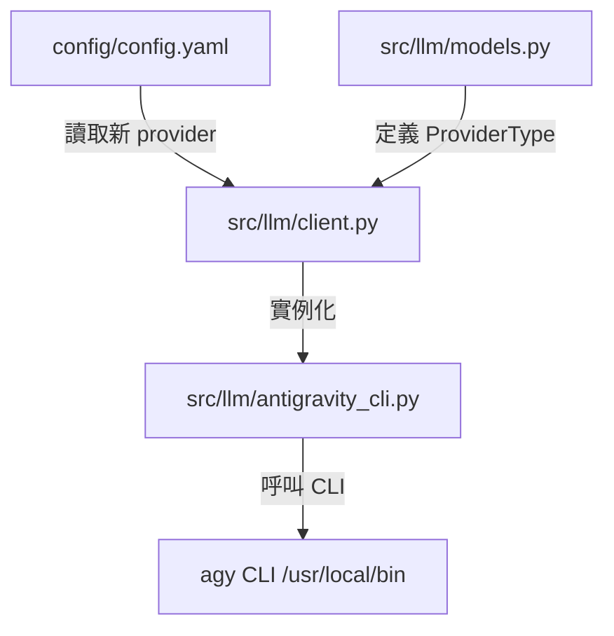

# Implementation Plan - Gemini CLI 遷移至 Antigravity CLI

這個計畫旨在因應 Google 官方將於 2026 年 6 月 18 日停用舊版 Gemini CLI 的變更，將 Knowledge Pipeline 的語意分析引擎無縫升級為最新的 **Antigravity CLI** (`agy` 命令)。

這樣能確保你的自動化轉錄管道在截止日期後依然穩定、完美地運作。

---

## 1. 核心研究發現與技術方案

經過對你系統的實際探索，我們有了突破性的發現：
1. 系統上已安裝最新的 **Antigravity CLI**，路徑為 `/home/openclaw/.local/bin/agy`。
2. 透過實際的測試指令 `echo "hello" | agy --print "hello, say 'pong' only"`，我們成功證實了 `agy` 具備極佳的**非互動式終端直輸模式 (`--print`)**。
3. **優點**：這個模式會直接將 AI 回答的純文字輸出到系統的 `stdout`，不會彈出任何 GUI 視窗，且支援透過 stdin 接收大型轉錄文字，是背景自動化腳本最完美的解決方案。

### 具體呼叫命令設計

我們將在 Python 腳本中，利用 `subprocess.run` 執行以下安全命令：
```python
subprocess.run(
    [
        "agy",
        "--dangerously-skip-permissions",  # 自動核准所有權限，確保背景腳本不卡死
        "--print",
        meta_prompt,                        # 引導模型只輸出 JSON 的指令
    ],
    input=combined_input,                    # 透過 stdin 傳遞 prompt + 影片轉錄稿
    capture_output=True,
    text=True,
    timeout=timeout
)
```

---

## 2. 變更範圍說明

所有的重構改動都是高度模組化且安全的，範圍僅限於 `llm` 模組設定：



---

### 3. 具體修改檔案計畫

#### 3.1 [MODIFY] [models.py](file:///home/openclaw/Projects/knowledge-pipeline/src/llm/models.py)
在 `ProviderType` 枚舉中，新增支援 `antigravity_cli`：
```diff
 class ProviderType(str, Enum):
     """支援的 LLM Provider 類型"""
     GEMINI_CLI = "gemini_cli"
+    ANTIGRAVITY_CLI = "antigravity_cli"
     OPENAI_API = "openai_api"
```

#### 3.2 [MODIFY] [client.py](file:///home/openclaw/Projects/knowledge-pipeline/src/llm/client.py)
在 `from_config` 中引入並實例化新 Provider：
```diff
         if provider_type == ProviderType.GEMINI_CLI:
             from src.llm.gemini_cli import GeminiCLIProvider
             ...
+        elif provider_type == ProviderType.ANTIGRAVITY_CLI:
+            from src.llm.antigravity_cli import AntigravityCLIProvider
+            provider = AntigravityCLIProvider(
+                project_dir=Path(config["project_dir"]),
+                timeout=config.get("timeout", 300),
+                max_retries=config.get("max_retries", 3),
+                initial_retry_delay=config.get("initial_retry_delay", 3),
+                debug_input=config.get("debug_input", False)
+            )
```

#### 3.3 [NEW] [antigravity_cli.py](file:///home/openclaw/Projects/knowledge-pipeline/src/llm/antigravity_cli.py)
* **實作內容**：新增 `AntigravityCLIProvider` 類別，繼承與 `GeminiCLIProvider` 相同的介面以保證完全相容。
* **重點邏輯**：
  * `health_check()`：執行 `agy --help`，確認指令可用。
  * `_call_gemini_with_streaming()`（更名為 `_call_agy_with_streaming()`）：執行上述的 `agy --dangerously-skip-permissions --print` 命令，並以 `stdin` 串流輸入完成分析。

#### 3.4 [MODIFY] [config.yaml](file:///home/openclaw/Projects/knowledge-pipeline/config/config.yaml)
將預設的 LLM Provider 設為最新遷移好的版本：
```diff
 # LLM Provider 設定
 llm:
   # Provider 類型: gemini_cli / openai_api / gemini_api / local_llm
-  provider: "gemini_cli"
+  provider: "antigravity_cli"
```

---

## 4. 驗證與測試計畫

為了保證代碼重構 100% 正確，我們會執行以下雙重驗證：

### 4.1 建立獨立的驗證腳本
我們將在 `scratch/` 目錄建立一個測試工具 `scratch/test_agy_connection.py`，實際使用模擬數據進行一次端到端的 AI 語意分析，確認 AI 回傳的 JSON 能被系統無誤地解析。
* 執行命令：
  ```bash
  python scratch/test_agy_connection.py
  ```

### 4.2 Pipeline 完整 Dry Run 測試
切換設定後，執行系統的完整模擬測試：
```bash
python run.py run --dry-run
```
這會模擬「掃描轉錄稿 -> 進行 Antigravity 語意分析 -> 打印模擬上傳結果」的完整流程，確保所有模組與狀態遷移完美配合。
